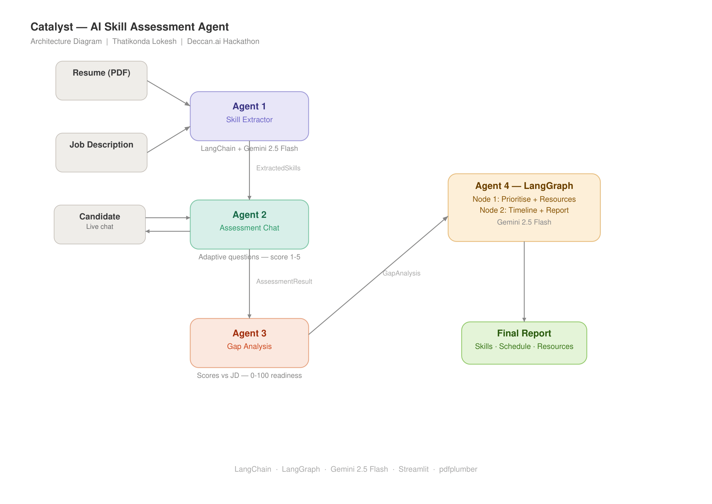

# Catalyst — AI Skill Assessment & Personalised Learning Plan Agent

> **Deccan.ai Hackathon Submission**
> Built by: Thatikonda Lokesh

---

## Problem Statement

A resume tells you what someone *claims* to know — not how well they actually know it. Catalyst is an AI agent that takes a Job Description and a candidate's resume, conversationally assesses real proficiency on each required skill, identifies gaps, and generates a personalised learning plan focused on adjacent skills the candidate can realistically acquire — with curated resources and time estimates.

---

## Architecture




## Flow
```
Resume (PDF/TXT) + Job Description
           │
           ▼
   ┌─────────────────┐
   │  Agent 1        │   LangChain + Gemini 2.5 Flash
   │  Skill Extractor│   → Extracts skills from Resume & JD
   └────────┬────────┘
            │
            ▼
   ┌─────────────────────────────────┐
   │  Agent 2                        │   LangChain Conversation
   │  Conversational Assessment Agent│ ←→ User (Live Chat)
   └────────────────┬────────────────┘
                    │ SkillAssessmentResult (scores 1-5 per skill)
                    ▼
   ┌─────────────────┐
   │  Agent 3        │   LangChain + Gemini 2.5 Flash
   │  Gap Analyser   │   → Compares scores vs JD requirements
   └────────┬────────┘
            │
            ▼
   ┌──────────────────────────────────────┐
   │  Agent 4: Learning Plan (LangGraph)  │
   │                                      │
   │  Node 1: Prioritise Gaps             │
   │          + Generate Resources        │
   │       ↓                              │
   │  Node 2: Build Weekly Timeline       │
   │          + Compile Final Report      │
   └────────────────┬─────────────────────┘
                    │
                    ▼
        Structured Report + Resources
```

---

## Quick Start

### 1. Clone & Setup

```bash
git clone <your-repo-url>
cd catalyst_project
python -m venv venv
source venv/bin/activate   # Windows: venv\Scripts\activate
pip install -r requirements.txt
```

### 2. Configure API Key

```bash
cp .env.example .env
# Edit .env and add your Gemini API key:
# GOOGLE_API_KEY=your_gemini_api_key_here
```

Get a **free** Gemini API key at: https://aistudio.google.com/apikey

### 3. Run

```bash
streamlit run app.py
```

Open http://localhost:8501 in your browser.

---

## File Structure

```
catalyst_project/
├── app.py                       # Streamlit UI — main interface
├── pipeline.py                  # Orchestrates all 4 agents
├── main.py                      # FastAPI server (alternative backend)
├── requirements.txt
├── .env.example
├── agents/
│   ├── skill_extractor.py       # Agent 1: Resume + JD parser (LangChain)
│   ├── assessment_agent.py      # Agent 2: Conversational interviewer (LangChain)
│   ├── gap_analysis_agent.py    # Agent 3: Gap scorer (LangChain)
│   └── learning_plan_agent.py   # Agent 4: Learning plan (LangGraph)
├── utils/
│   └── pdf_extractor.py         # PDF/TXT text extraction (pdfplumber)
└── templates/
    └── index.html               # FastAPI frontend (alternative UI)
```

---

## How It Works

### Agent 1 — Skill Extractor
- Parses resume (PDF/TXT) using `pdfplumber`
- Sends resume and JD to Gemini 2.5 Flash via LangChain
- Extracts all technical skills, experience, education from resume
- Extracts required skills, preferred skills, responsibilities from JD
- Returns strongly-typed `ExtractedSkills` Pydantic object

### Agent 2 — Conversational Assessment
- Adaptive interviewer powered by LangChain + Gemini 2.5 Flash
- Asks 5 focused, practical questions — one per required skill
- Each question is scenario-based (not just "do you know X?")
- Tracks answer time per question
- Scores each skill 1–5 after conversation completes
- Scoring rubric: 1=None, 2=Beginner, 3=Intermediate, 4=Advanced, 5=Expert

### Agent 3 — Gap Analysis
- Compares assessment scores vs JD required scores
- Required skills need score ≥ 3 (Mid-level) or ≥ 4 (Senior)
- Calculates overall readiness score (0–100)
- Weighted: required skills 70%, preferred skills 30%
- Identifies adjacent skills the candidate can realistically acquire
- Classifies gaps as Critical / High / Medium / Low priority

### Agent 4 — Learning Plan (LangGraph — 2-node optimised pipeline)
- **Node 1:** Prioritise gaps + generate skill learning plans in one LLM call
  - Ranks skills by impact (Critical → High → Medium → Low)
  - Curates 2 real resources per skill (YouTube, Coursera, official docs)
  - Suggests a specific practice project per skill
- **Node 2:** Build weekly timeline + compile final report in one LLM call
  - Week-by-week schedule at 2 hrs/day commitment
  - Executive summary, strengths, final advice

---

## Judging Criteria Coverage

| Criteria | Weight | How We Address It |
|---|---|---|
| Works end-to-end | 20% | Upload → Chat → Gap Analysis → Report — full pipeline with fallbacks |
| Core agent quality | 25% | Adaptive conversation, 1–5 scoring rubric, LangGraph orchestration |
| Output quality | 20% | Real resource links, time estimates, weekly schedule, practice projects |
| Technical implementation | 15% | LangGraph StateGraph, LangChain LCEL, Pydantic schemas, Gemini 2.5 Flash |
| Innovation & creativity | 10% | Adjacent skill detection, answer time tracking, readiness score formula |
| UX | 5% | Clickable nav, dark mode, progress bar, input clears after send |
| Clean, documented code | 5% | Modular agents, docstrings, typed schemas, error handling + fallbacks |

---

## Tech Stack

| Component | Technology |
|---|---|
| LLM | Gemini 2.5 Flash (Google AI Studio — free tier) |
| Agent Framework | LangChain 0.3.25 |
| Orchestration | LangGraph 0.4.1 |
| Output Parsing | LangChain PydanticOutputParser |
| Resume Parsing | pdfplumber 0.11.6 |
| UI | Streamlit 1.44.1 |
| Backend (alt) | FastAPI + Uvicorn |
| Data Validation | Pydantic 2.11.4 |

**All tools used are free tier — no paid credits required.**

---

##  Scoring Logic

### Proficiency Score (1–5)
| Score | Label | Meaning |
|---|---|---|
| 1 | None | Never used, no knowledge |
| 2 | Beginner | Heard of it, basic awareness |
| 3 | Intermediate | Used in projects, understands core concepts |
| 4 | Advanced | Strong hands-on, handles edge cases |
| 5 | Expert | Deep mastery, can teach others |

### Readiness Score (0–100)
```
Readiness = (avg score of required skills × 0.70) +
            (avg score of preferred skills × 0.30)
Normalised to 0–100 scale

Labels:
  0–40   → Not Ready
  41–60  → Partially Ready
  61–80  → Ready
  81–100 → Highly Ready
```

### Gap Priority
```
Critical → Required skill, gap ≥ 2 levels
High     → Required skill, gap = 1 level
Medium   → Preferred skill with gap
Low      → Minor gap or optional skill
```

---

##  Sample Input / Output

**Input:**
- Resume: `resume.pdf` (2 years exp, Python + basic ML background)
- JD: Generative AI & Data Science Engineer — Python, LangChain, RAG, Prompt Engineering, NLP required

**Sample Output:**
```json
{
  "overall_readiness_score": 71,
  "readiness_label": "Partially Ready",
  "total_learning_weeks": 10,
  "daily_hours_commitment": 2.0,
  "skill_plans": [
    {
      "skill": "RAG",
      "current_level": "None",
      "target_level": "Intermediate",
      "estimated_weeks": 3,
      "priority": "Critical",
      "why_important": "Core architecture for GenAI applications",
      "resources": [
        {
          "title": "RAG Tutorial - LangChain",
          "url": "https://www.youtube.com/results?search_query=RAG+LangChain+tutorial",
          "platform": "YouTube",
          "duration": "3 hours",
          "is_free": true
        }
      ],
      "practice_project": "Build a PDF Q&A chatbot using RAG + Gemini"
    }
  ],
  "weekly_schedule": [
    {
      "week_number": 1,
      "focus_skills": ["RAG"],
      "daily_hours_needed": 2.0,
      "milestones": ["Understand retrieval concepts", "Set up vector store"],
      "deliverable": "Can explain RAG pipeline and implement basic retrieval"
    }
  ]
}
```

---

##  APIs & Tools Declaration

| Tool | Purpose | Cost |
|---|---|---|
| Google Gemini 2.5 Flash | LLM for all 4 agents | Free tier |
| LangChain | Agent framework + LCEL chains | Free / Open source |
| LangGraph | Multi-agent orchestration | Free / Open source |
| pdfplumber | Resume PDF parsing | Free / Open source |
| Streamlit | Web UI | Free / Open source |
| FastAPI | REST API backend | Free / Open source |
| Pydantic | Data validation | Free / Open source |

No paid API credits used. Everything runs on free tiers.

---

##  Submission Info

- **Built by:** Thatikonda Lokesh
- **Hackathon:** Catalyst by Deccan.ai
- **Model:** Gemini 2.5 Flash
- **Stack:** LangChain + LangGraph + Streamlit